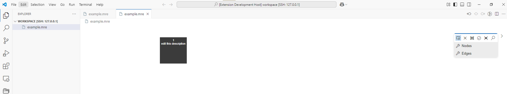

# VSCodeTheiaUndoExample

This repository serves as a minimal reproducible example to highlight the difference in 'undo' functionality between Theia vs VSCode when building a vscode extension


The workspace folder contains a simple example file 'example.mre'

This contains one entry:
```
entry 1: 'edit this description'
```

To build the example:
```
npm install
```
```
npm run build
```

To package the vscode extension:
```
npm run vscode:package
```

To reproduce the issue:

Open the example.mre in the 'Text Editor' (Langium Editor)


Open the example.mre in the 'MRE Diagram Editor', keep the 'Text Editor' open so you can go observe the differences.



Now double click on the description text in the center of the node 'edit this description'. This will open an in line text editor, change the description to something else and then hit enter.


This will update the diagram node to show the changed description:


And in the 'Text Editor' it will also show the change:


Now go back to the 'MRE Diagram Editor' and use the keyboard shorcut for undo ctrl + z.

In VSCode this will undo the change in both the 'Text Editor' and the 'MRE Diagram Editor'.

In Theia this will undo nothing.